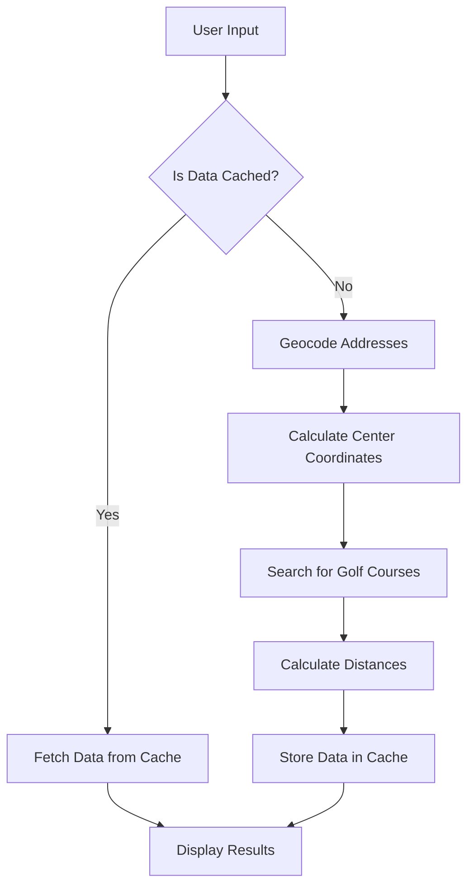

# About

The Litestar Golf Buddy app is designed to help golfers find the best golf courses based on their location and preferences. 
It allows users to input their addresses, and the app will calculate the closest and most suitable golf courses for them. 
The app also provides information on distances between players and estimated travel times.

# How to Install

To install and set up the Golf Buddy app, follow these steps:

1. Clone the repository:
    ```bash
    git clone https://github.com/JacobCoffee/gobuddy.git
    cd gobuddy
    ```

2. Install app, run app
    ```bash
    make install
    make serve
    ```

3. Open your browser and navigate to: http://localhost:8000

# Architecture

The Litestar Golf Buddy app is built using a modular architecture that separates concerns into different components. 
This helps in maintaining the codebase, making it easier to understand, extend, and test.

Below is an overview of the main components and their responsibilities:

## Components

### 1. **Frontend**
  - The frontend is responsible for rendering the user interface and handling user interactions. 
    It includes templates for different pages such as the home page, search results, and error pages. 
  - One upcoming feature will be the use of Vite and an enhanced frontend experience for users and developers.

### 2. **Backend**
  - The Litestar backend handles the core logic of the application, including processing user inputs, 
    performing geocoding, searching for golf courses, and calculating distances. 
    It exposes various endpoints that the frontend interacts with at `/api`

### 3. **Database**
  - SQLite database stores information about players, golf courses, and other relevant geo data

### 4. **Services**
  - **Geocoding Service:** Converts addresses into latitude and longitude coordinates via `geopy` library.
  - **Course Search Service:** Finds golf courses based on the calculated center coordinates using `geopy` library.
  - **Distance Calculation Service:** Computes distances between players and golf courses using `geopy` library.

## Data Flow

1. **User Input:**
   - Users enter their addresses and names in the frontend form.
   
2. **Request Handling:**
   - The frontend sends the user input to the backend via an HTTP request.

3. **Geocoding:**
   - The backend uses the Geocoding Service to convert addresses into coordinates.

4. **Center Calculation:**
   - The backend calculates the center point based on the coordinates of all players.

5. **Course Search:**
   - The backend uses the Course Search Service to find golf courses around the center point.

6. **Distance Calculation:**
   - The backend calculates the distances from each player to the found golf courses.

7. **Response:**
   - The backend sends the search results back to the frontend.

8. **Results Display:**
   - The frontend renders the search results, displaying the best golf courses and distances.


# How Search Works

The search functionality in the Litestar Golf Buddy app works as follows:

1. User Input: Users enter their addresses and names in the provided form fields.
2. Geocoding: The app geocodes the provided addresses to obtain latitude and longitude coordinates.
3. Center Calculation: The app calculates the center coordinates based on the geocoded addresses of all players.
4. Course Search: The app searches for golf courses around the calculated center coordinates.
5. Distance Calculation: The app calculates the distances from each player to the found golf courses.
6. Results Display: The app displays the best golf courses along with the distances and estimated travel times for each player.

<details>

<summary>Diagram</summary>

### Search Breakdown


</details>

# Contributing

They are welcome.

# TODO

- Fix `city` unknowns using nearby:city or voting area
- When clicking to add cached player, replace Player 1, Player 2, etc. with the cached player's name if empty
- Add a route and button to clear all players
- Add a route and button to clear courses
- Find way to get course type (private,public)
  - (Selenium?)
- Find a way to get course data (API, Selenium?)
  - Rating
  - Handicap
  - Schedule
  - Green fees
  - Phone number
  - Website
- Add button to generate directions for each player to course
- Login system so that we don't publicly expose addresses
  - Maybe we can just use browser session / cookies to not complicate
